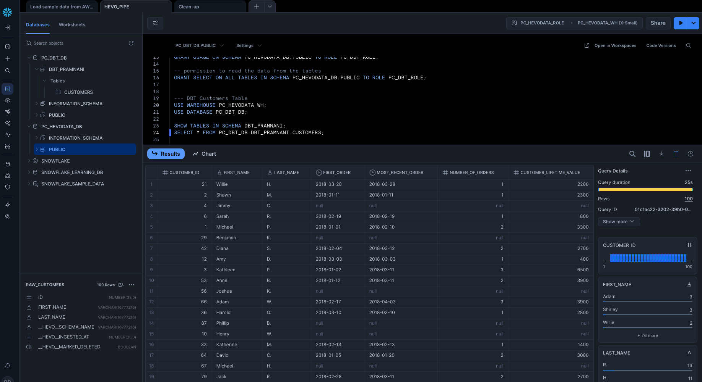

### Phase 1: Local Environment (Docker & Postgres)

*Postgres v17 container is running with custom port 5433.*

### Phase 3: The Connectivity Bridge (ngrok)

*Created tables in the PSQL bucket from Snowflake files*

### Phase 3: The Connectivity Bridge (ngrok)

*The active TCP tunnel providing the public endpoint for hevo pipeline source connection.*

### Phase 4: Pipeline Success (Hevo Data)

*Successful Pipeline created*

### Phase 5: Transformation (dbt & Snowflake)

*The dbt model to create the final Customer model.*

*Final query results in Snowsight showing customers, their first oder and calculated Customer Lifetime Value (CLV).*